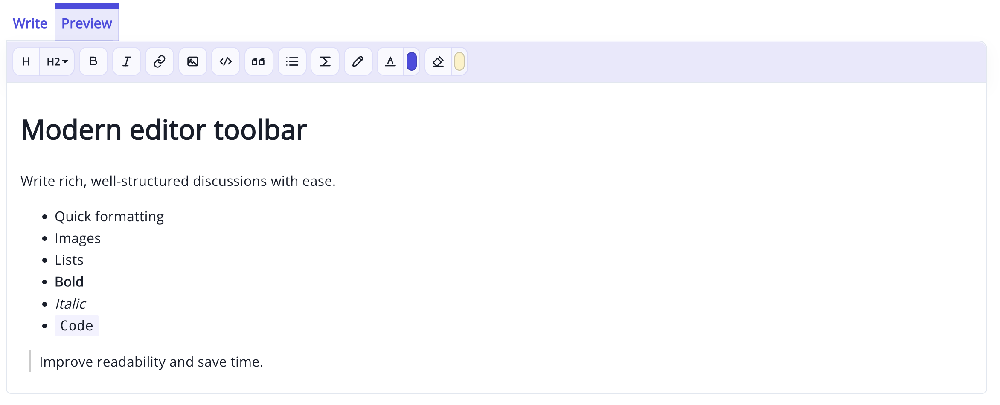

<h1>GreasyFork Premium</h1>

<strong>Transform GreasyFork &amp; SleazyFork into a modern, productivity-focused experience.</strong>

 

 

**[GreasyFork Premium](https://greasyfork.org/scripts/562938-greasyfork-premium)** modernizes GreasyFork and SleazyFork with a redesigned interface, faster navigation, powerful editing tools, and productivity-focused improvements, while preserving the core functionality of both websites.

  

Designed to improve your daily workflow while keeping GreasyFork familiar and lightweight.

---

## 📑 Contents

- [📚 Documentation](#-documentation)
- [✨ Main Features](#-main-features)
- [📦 Third-party Libraries](#-third-party-libraries)
- [💬 Feedback & Contribution](#-feedback--contribution)
- [💡 Community Suggestions](#-community-suggestions)
- [👤 Author](#-author)
- [📄 License](#-license)

---

## 📚 Documentation

| Guide | Description |
|------|-------------|
| [Installation Guide](./docs/INSTALLATION.md) | Install GreasyFork Premium on supported browsers |
| [FAQ](./docs/FAQ.md) | Answers to common questions |
| [Troubleshooting](./docs/TROUBLESHOOTING.md) | Fix common issues and known limitations |
| [Privacy Policy](./docs/PRIVACY.md) | Learn how data and local settings are handled |
| [Changelog](./CHANGELOG.md) | View version history and release notes |
| [Roadmap](./ROADMAP.md) | See planned improvements and community suggestions |
| [Contributing](./CONTRIBUTING.md) | Learn how to report bugs, suggest ideas, or contribute |

---

## ✨ Main features

### ⚡ Productivity Boost

- One-click favorites directly from script cards
- Personal notes attached to scripts
- Redesigned favorites management (faster, cleaner, more intuitive)
- Direct install button without opening the script page
- Expandable script details directly from script cards

### 📝 Personal Notes

- Add personal notes to scripts
- Notes are saved automatically
- Preview, edit, and delete notes directly from script cards and script pages
- Keep track of scripts to test, compare, or revisit later

### 🎨 Interface & Experience

- Modernized interface with improved visual hierarchy
- Cleaner layout with improved visual consistency
- Light, System, and Dark theme modes
- Automatic light/dark theme switching based on your operating system
- Support for both GreasyFork and SleazyFork

### 🧭 Navigation and Quick Actions

- Immediate access to essential actions
- Settings and script edit buttons directly accessible
- Replaced logout text link with a modern icon
- Reduced number of clicks for common actions
- Collapsible sidebar groups with saved state
- Quick navigation buttons for jumping to the top or bottom

### 🖼️ Image Experience

- Modern image lightbox
- Zoom support on desktop and mobile
- Improved image viewing inside script pages

### ✍️ Editor Enhancements

- Modern formatting toolbar for comments and discussions
- Quick insertion of headings, links, images, code blocks, quotes, lists, details, and highlights
- Faster and more comfortable writing experience

  

### 💻 Code Readability

- Improved code block rendering
- Syntax highlighting via **Highlight.js**
- Better readability for scripts and snippets

---

## 📦 Third-party Libraries

| Library | Purpose | License |
|---------|---------|---------|
| Highlight.js | Syntax highlighting | BSD 3-Clause |

---

## 💬 Feedback & Contribution

Suggestions, feature requests, bug reports, and contributions are always welcome.

| Channel | Best for |
|---------|----------|
| [GitHub Discussions](https://github.com/DREwX-code/greasyfork-premium/discussions) | Ideas, feature requests, and questions |
| [GitHub Issues](https://github.com/DREwX-code/greasyfork-premium/issues) | Bug reports and technical issues |
| [GreasyFork Feedback](https://greasyfork.org/scripts/562938-greasyfork-premium/feedback) | General feedback and comments |
| [Contributing Guide](./CONTRIBUTING.md) | Contribute code, documentation, or translations |

> Before opening a bug report, please check the **[Troubleshooting Guide](./docs/TROUBLESHOOTING.md)** and include clear steps to reproduce the issue.

---

## 💡 Community Suggestions

Community suggestions currently under consideration:

- Interface density modes (compact / comfortable / detailed)

Recently completed community suggestions include personal notes attached to scripts, system theme mode, and profile website link overflow fixes.

See the full **[Project Roadmap](./ROADMAP.md)**.

---

## 👤 Author

Developed and maintained by **Dℝ∃wX**  
GitHub: [DREwX-code](https://github.com/DREwX-code)

---

## 📄 License

This project is licensed under the **Apache License 2.0**.  
You are free to use, modify, and distribute this project in accordance with the terms of the license.
